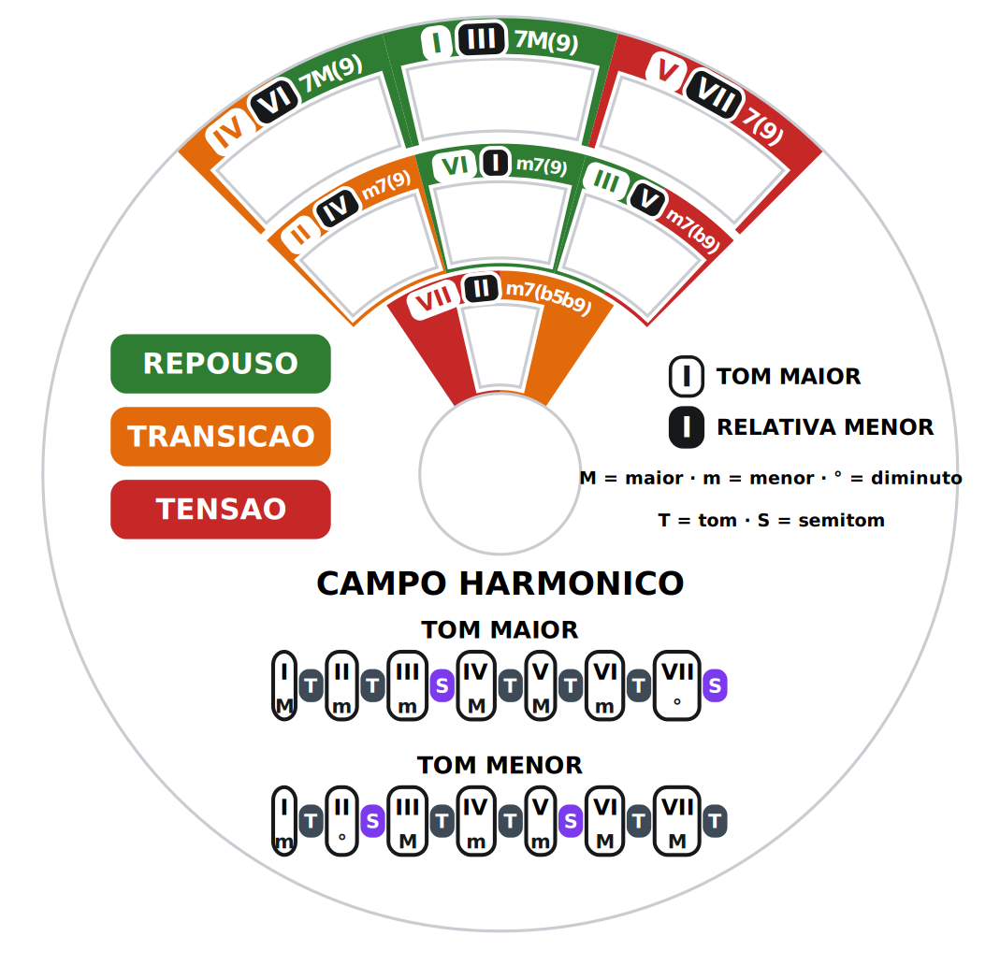
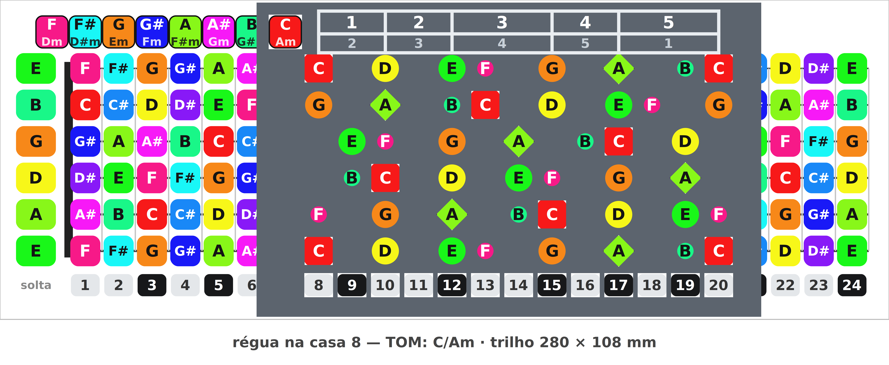

# music-ruler

Duas ferramentas de teoria musical para violão/guitarra, feitas para imprimir em 3D.

Mesma receita nas duas: **plástico liso impresso em 3D + arte colorida em papel** colada
nos rebaixos. Toda a cor e todo o texto vêm do papel — mudar o conteúdo não exige
reimprimir nada em 3D.

| | |
|---|---|
|  |  |

## [`roda/`](roda) — Roda de campo harmônico
Volvelle. Gire até a tônica aparecer na janela do meio e o campo harmônico inteiro
aparece de uma vez: 3 acordes maiores, 3 menores e o diminuto.

Cada janela traz duas pastilhas — **branca = grau no tom maior, preta = grau no tom
menor relativo**. A cor da célula diz a função: verde repouso, laranja transição,
vermelho tensão. O disco de cima ainda traz as tabelas de intervalos
(`T T S T T T S` / `T S T T S T T`) e a qualidade de cada grau.

## [`regua/`](regua) — Régua de escalas
Trilho com o mapa de notas de 24 casas + régua deslizante furada nas notas da escala.
Deslize até a tônica cair no furo e as 5 formas (CAGED) se posicionam sozinhas.

**Quadrado = tônica maior · losango = tônica da relativa menor · círculo = pentatônica ·
triângulo = graus 4 e 7.** A janela `TOM` mostra a tonalidade, e as janelinhas de baixo
mostram a casa e a gêmea de oitava. A mesma peça serve os 12 tons — porque o espaçamento
das casas é uniforme, e não logarítmico como num braço de verdade.

Duas **cortinas** correm num segundo canal, entre o papel e a régua: empurre uma de cada
lado e só a forma que você está estudando fica visível.

## Imprimir

| Peça | Tamanho | Peso |
|---|---|---|
| `roda/stl/roda_1-DISCO-BASE.stl` | ⌀118 × 15,3 mm | ~40 g |
| `roda/stl/roda_2-DISCO-GIRATORIO.stl` | ⌀110 (+aba 120) × 8 mm | ~20 g |
| `regua/stl/regua_1-TRILHO.stl` | 280 × 108 × 7,2 mm | ~54 g |
| `regua/stl/regua_2-REGUA-DESLIZANTE.stl` | 154 × 95 × 2,4 mm | ~12 g |
| `regua/stl/regua_3-CORTINA.stl` (imprimir **2**) | 112 × 96 × 1,8 mm | ~8 g cada |

Sem suporte em nenhuma peça — a retenção é por **rabo de andorinha a 45°**, sem aba
pendurada. Bico 0,4 · camada 0,16 · 3 perímetros · 20 %.
**PETG** de preferência. O trilho tem 280 mm de comprimento — brim de 5 mm, mesa a 80 °C
e câmara fechada, senão as pontas levantam.

### Antes de recortar o papel: confira a escala
Todo PDF imprime em **A4, 100 % / tamanho real**, com "ajustar à página" DESMARCADO.
A folha da roda traz uma **barra de 100 mm** no rodapé: meça com uma régua. Se não der
100 mm exatos, reimprima com escala `100 × 100 ÷ (o que deu)`. Papel fora de escala é o
que faz os acordes da borda não caírem dentro da janela.

São três colagens: o mapa de notas no trilho, a etiqueta das formas no topo da régua e a arte da roda nos dois discos. Rebaixos de 0,35 mm: papel comum ou cartão fino. Cola em bastão ou spray — cola branca
empena o papel.

## Regerar tudo

```sh
./build.sh
```

Precisa de `openscad`, `python3`, `cairosvg` e `pypdf`.

Os geradores de arte (`arte.py`, `arte_regua.py`) **se verificam sozinhos**: abortam sem
gravar o arquivo se algum texto invadir linha de corte, transbordar a célula, encostar no
furo central ou se dois blocos se sobrepuserem. Foi assim que apareceram vários erros que
teriam ido para a impressora.

Cada `.scad` tem os parâmetros de ajuste comentados no topo — folga do encaixe, espessura
do papel, afinação das cordas.
