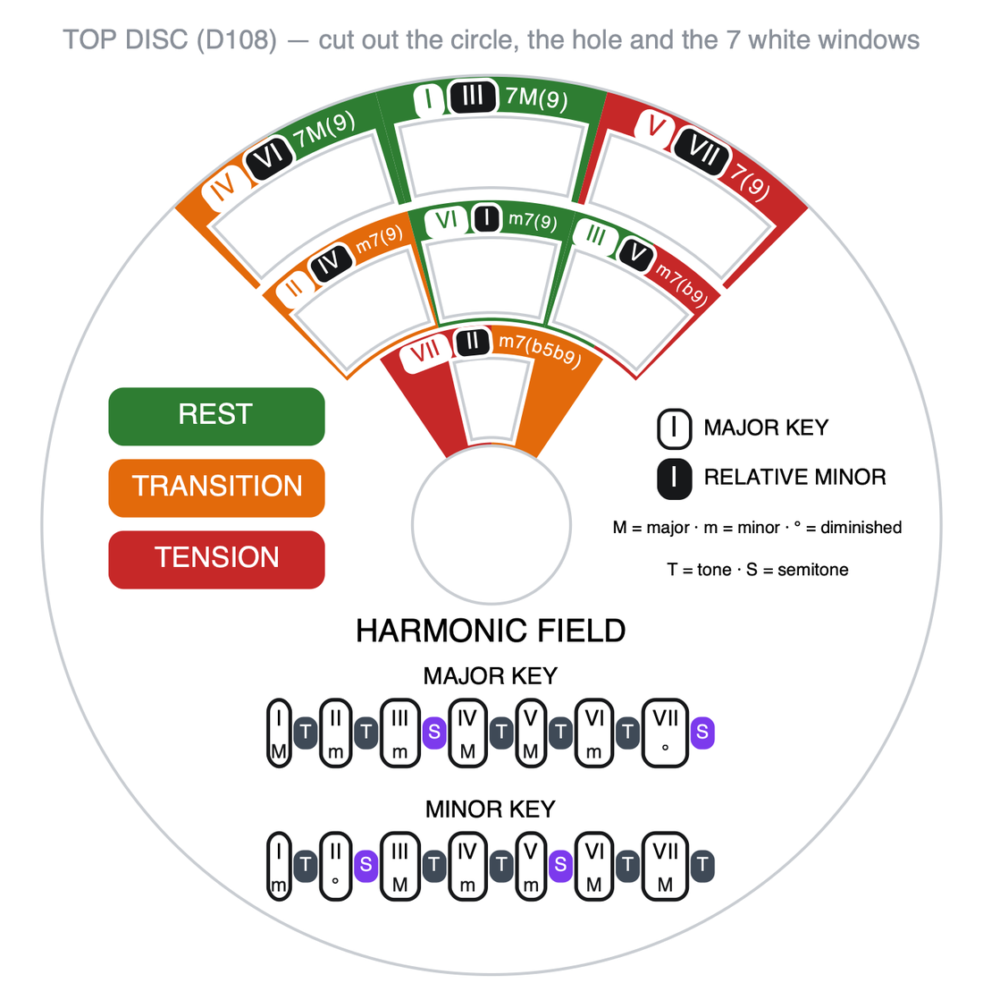
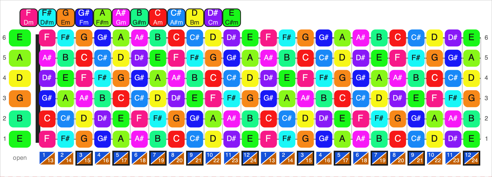

# music-ruler

Two music-theory tools for guitar, made to be 3D printed.

Same recipe in both: **plain 3D-printed plastic + colored paper art** glued into the
recesses. All the color and all the text come from the paper — changing the content
never means reprinting anything in 3D.

The printed art is generated in **English, Portuguese and Spanish**; pick the PDF in
the language you want.

| | |
|---|---|
|  |  |

## [`harmonic-field/`](harmonic-field) — Harmonic field wheel
A volvelle. Turn it until the tonic shows up in the middle window and the whole harmonic
field appears at once: 3 major chords, 3 minor ones and the diminished.

Each window carries two chips — **white = degree in the major key, black = degree in the
relative minor key**. The cell color tells you the function: green rest, orange
transition, red tension. The top disc also carries the interval tables
(`T T S T T T S` / `T S T T S T T`) and the quality of every degree.

## [`scale/`](scale) — Scale ruler
A track with the 24-fret note map + a sliding ruler drilled at the notes of the scale.
Slide until the tonic lands in a hole and the 5 CAGED shapes place themselves.

**Square = major tonic · diamond = relative minor tonic · circle = pentatonic ·
triangle = degrees 4 and 7.** The `KEY` window shows the tonality, and the little windows
along the bottom show the fret and its octave twin. The same piece serves all 12 keys —
because the fret spacing is uniform, not logarithmic like a real neck.

Under the slider run two more parts, each in its own channel. The **cassette** is two
masks rigidly joined with a 4-fret window between them: slide it until the window lands
on the shape you want and everything else on the neck goes dark — one move, no bracketing.
Three of the five CAGED boxes are 3 frets wide instead of 4, and for those the **blade**
closes the one fret left over. The blade lives under the slider, so it is worked by two
tails that always reach past it: you pull a tail, never push.

A step-by-step guide to playing with it: [`docs/how-to-use.md`](docs/how-to-use.md).

## Printing

| Part | Size | Weight |
|---|---|---|
| `harmonic-field/stl/field_1-BASE-DISC.stl` | ⌀118 × 15.3 mm | ~40 g |
| `harmonic-field/stl/field_2-TOP-DISC.stl` | ⌀110 (+tab 120) × 8 mm | ~20 g |
| `scale/stl/scale_1-TRACK.stl` | 280 × 108 × 11.4 mm | ~60 g |
| `scale/stl/scale_2-SLIDER.stl` | 154 × 97.0 × 2.4 mm | ~26 g |
| `scale/stl/scale_3-CASSETTE.stl` | 224 × 97.0 × 1.8 mm | ~32 g |
| `scale/stl/scale_4-BLADE.stl` | 181 × 97.0 × 1.8 mm | ~4 g |
| `scale/stl/scale_0-FIT-COUPON.stl` | 125 × 108 × 9.8 mm | ~10 g |

All three moving plates are the same width (97.0 mm) and every channel has the same
profile, so a plate fits any of the three.

Weights are the model volume, solid for the thin plates and at 20 % infill for the track;
your slicer is the authority.

**Print `scale_0-FIT-COUPON.stl` first.** It is a 20 mm stub of the channel plus a
section of each of the three plates: slide them together and you know the fit before
committing five hours to the track. It is 10 cm³ against the track's 108 — the base under
the channel is shaved to 1 mm and the plate sections are hollowed out, because neither
carries any part of the fit. Too tight? Raise `FIT` in `scale/scale.scad`.

No supports on any part — retention is by a **45° dovetail**, with nothing bridged in
mid-air. 0.4 nozzle · 0.16 layer · 3 perimeters · 20 %.
**PETG** preferably. The track is 280 mm long — use a 5 mm brim, bed at 80 °C and a
closed chamber, otherwise the ends lift.

### Before cutting the paper: check the scale
Every PDF prints on **A4, 100 % / actual size**, with "fit to page" UNCHECKED.
The wheel sheet carries a **100 mm bar** in the footer: measure it with a ruler. If it
is not exactly 100 mm, print again at scale `100 × 100 ÷ (what you measured)`. Paper out
of scale is what makes the chords near the rim miss their window.

Three glue-ups: the note map onto the track, the shape label onto the top of the slider,
and the wheel art onto both discs. The recesses are 0.35 mm deep: plain paper or thin
card. Glue stick or spray — white glue warps the paper.

## Regenerating everything

```sh
./build.sh
```

Needs `openscad`, `python3`, `cairosvg` and `pypdf`.

The art generators (`art_field.py`, `art_scale.py`) **check themselves**: they abort
without writing the file if any text crosses a cut line, overflows its cell, touches the
center hole, runs off the page, or if two blocks overlap. That is how several mistakes
that would have gone to the printer were caught.

Both take two environment variables:

| Variable | Values | Meaning |
|---|---|---|
| `ART_LANG` | `en` `pt` `es` | language of every printed label (default `en`) |
| `COLOR` | `1` `0` | `0` renders the black-and-white version |

`ART_LANG` is deliberately not called `LANG` — that name already belongs to the shell
locale. `build.sh` loops over all three languages; `LANGS="en" ./build.sh` builds just one.

Each `.scad` has its tuning parameters commented at the top — fit clearance, paper
thickness, string tuning.
